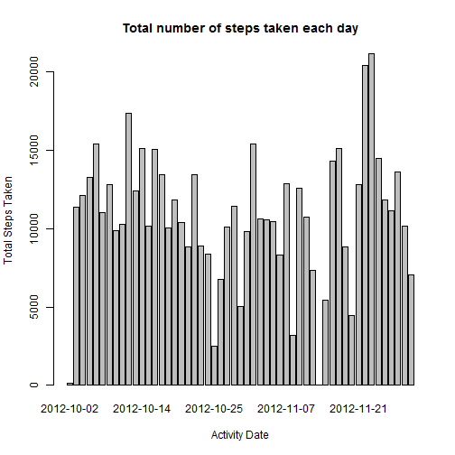
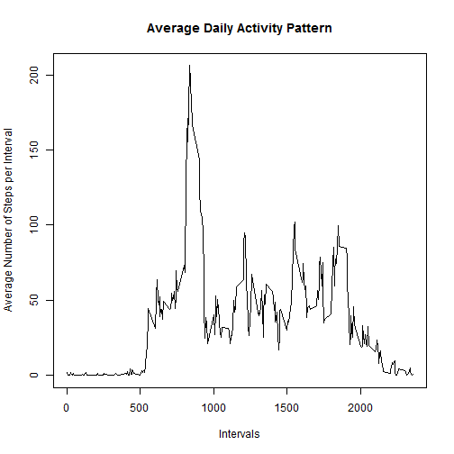
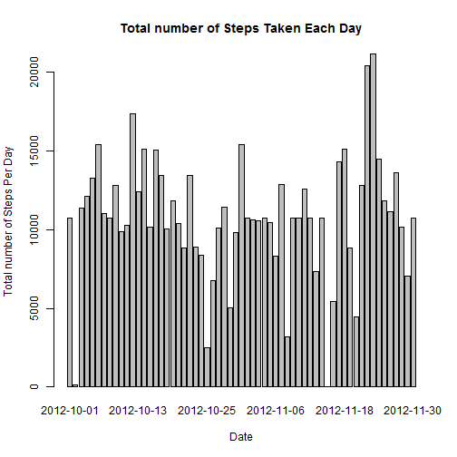
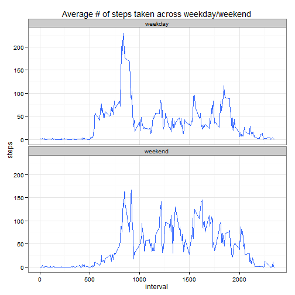

Reproducible Research /Peer Assessment 1
========================================


###Loading and preprocessing the data

1: Load the data


```r
ActivityData <- read.csv("activity.csv", header=TRUE)
```

2: Process/transform the data (if necessary) into a format suitable for your analysis

```r
ActivityData$date <- as.Date(ActivityData$date, '%Y-%m-%d')
DailySteps <- aggregate(steps ~ date, ActivityData, sum, na.rm = TRUE)
```


###What is mean total number of steps taken per day?

1: Make a histogram of the total number of steps taken each day


```r
hist<-barplot(DailySteps$steps, names.arg = DailySteps$date, axes = TRUE, xlab = "Activity Date", ylab="Total Steps Taken", main="Total number of steps taken each day")
```

 


2: Calculate and report the mean and median total number of steps taken per day


```r
MeanOfSteps<- mean(DailySteps$steps,na.rm=TRUE)
MedianOfSteps<-median(DailySteps$steps,na.rm=TRUE)
```


###What is the average daily activity pattern?

1: Make a time series plot (i.e. type = "l") of the 5-minute interval (x-axis) and the average number of steps taken, averaged across all days (y-axis)


```r
AvgInterval <- aggregate(steps ~ interval, ActivityData, mean)
plot(AvgInterval, type = "l", xlab="Intervals", ylab="Average Number of Steps per Interval", main="Average Daily Activity Pattern")
```

 


2: Which 5-minute interval, on average across all the days in the dataset, contains the maximum number of steps?


```r
AvgInterval$interval[which.max(AvgInterval$steps)]
```

```
## [1] 835
```


###Imputing missing values

1: Calculate and report the total number of missing values in the dataset (i.e. the total number of rows with NAs) 


```r
sum(!complete.cases(ActivityData))
```

```
## [1] 2304
```

3: Create a new dataset that is equal to the original dataset but with the missing data filled in.


```r
ActivityData <- merge(ActivityData, AvgInterval, by = "interval", suffixes = c("", ".y"))
NASteps <- is.na(ActivityData$steps)
ActivityData$steps[NASteps] <- ActivityData$steps.y[NASteps]
ActivityData <- ActivityData[, c(1:3)]
```

4: Make a histogram of the total number of steps taken each day 


```r
TotStepsEachDay <- aggregate(steps ~ date, ActivityData, sum)
barplot(TotStepsEachDay$steps, names.arg = TotStepsEachDay$date, xlab = "Date", ylab = "Total number of Steps Per Day",main="Total number of Steps Taken Each Day")
```

 

and Calculate and report the mean total number of steps taken per day. 


```r
mean(TotStepsEachDay$steps)
```

```
## [1] 10766.19
```

and Calculate and report the median total number of steps taken per day. 


```r
median(TotStepsEachDay$steps)
```

```
## [1] 10766.19
```


### Are there differences in activity patterns between weekdays and weekends

1: Create a new factor variable in the dataset with two levels - "weekday" and "weekend" indicating whether a given date is a weekday or weekend day 


```r
ActivityData$WeekType <- ifelse(weekdays(ActivityData$date) %in%  c("Saturday", "Sunday"),'weekend','weekday')
```

2: Make a panel plot containing a time series plot (i.e. type = "l") of the 5-minute interval (x-axis) and the average number of steps taken, averaged across all weekday days or weekend days (y-axis). 


```r
library(ggplot2)
qplot(x=interval, y=steps,data=subset(ActivityData, complete.cases(ActivityData)),geom='smooth', geom_line(color='blue'), stat='summary', fun.y=mean) + facet_grid(WeekType~.) + facet_wrap(~WeekType,nrow=2) + labs(title='Average # of steps taken across weekday/weekend') + theme_bw()
```

 

